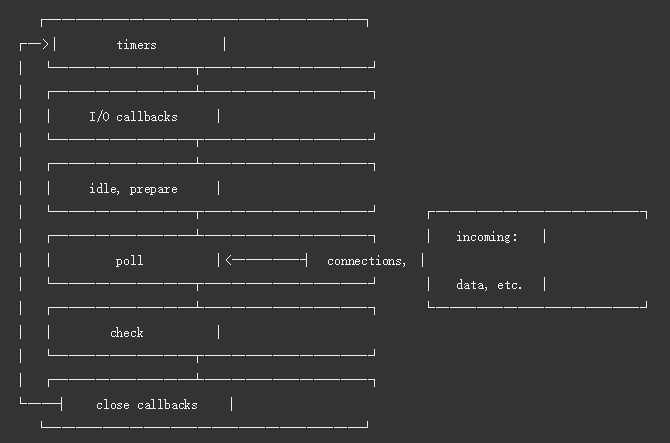

# node evenloop 

evenloop 是js运行环境(runtime)提供的功能，js本身无这个功能

v8是引擎，node是运行环境
v8是engine，node是runtime

事件轮询的6个基本阶段

1. timer ：执行timer（setTimeout, setInterval）定的callback
2. I/O callbacks ：
    执行除了close事件的callbacks，
    被timer（setTimeout，setInterval）设定的callbacks，
    setImmediate设定的callbacks  以外的所有callbacks
3. idle,prepare ：仅仅node内部使用
4. poll ：获取所有的I/O事件，适当的条件下node将阻塞在这里
5. check ：执行setImmediate()设定的callbacks
6. close callbacks ：比如socket.on(‘close’, callback)的callback会在这个阶段执行

以上每个阶段完成都会就检测一次process.nextTick（我的理解）

## 疑问解答：
###  1.poll阶段中已经完成了所有I/O 的callback，为什么还要一个I/O callbacks阶段？ 

答：查询libuv的文档后发现，在libuv的evenloop中，`I/O callbacks` 阶段会执行`Pending callbacks`。
绝大多数情况下，在`poll`所有的I/O回调都已经被处理了。但是，在某些阶段下，有一些回调会被延迟到下一次循环，
也就是说`I/O callback`阶段执行的回调函数，是上一次循环中被延迟执行的函数。

### 2.process.nextTick 和 setImmediate 区别
`process.nextTick()` 产生的回调函数，被保存在一个`nextTickQueue`的队列中，不在上面任何一个阶段队列里面。
当当前操作完成后，`nextTickQueue`中的回调函数会立即被执行，不管事件循环处在哪个阶段。
也就是说，在`nextTickQueue`中的回调函数执行完毕之前，事件不会往前推进。

`setImmediate`

参考：
1. [* The Node.js Event Loop, Timers, and process.nextTick(中文翻译)](https://cnodejs.org/topic/57d68794cb6f605d360105bf)
2. [* 疑问1 2 的解答](http://www.cnblogs.com/bingooo/p/6720540.html)

3. [可能有用的参考](https://github.com/creeperyang/blog/issues/26)