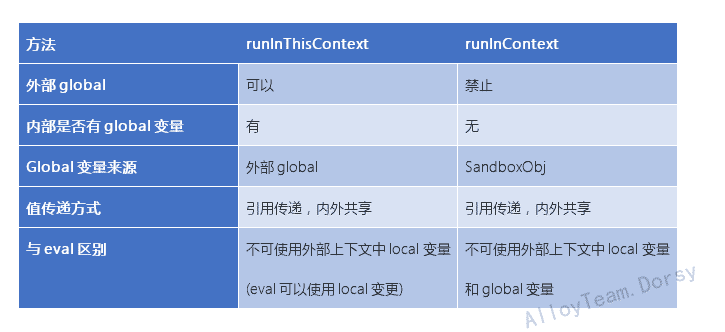

# vm (virtual machine)

注意: vm模块并不是实现代码安全性的一套机制。 绝不要试图用其运行未经信任的代码.

用途： create a sandbox environment where your can safely run other scripts.
创建一个安全的隔离的沙箱空间 (不知道哪里抄来的，但是官方文档并没有这个说法，vm并不提供一套安全机制)

参数主题就2点 **script**和**上下文共享关系**

## 基础api
* vm.script 创建ContextifyScript，等待被run
* vm.createContext  通过 sandBoxObject  创建 sandBoxContext
* script.runInContext        能局部影响当前作用域的对象  (context对象)
* script.runInNewContext     能局部影响当前作用域的对象  (普通对象)   为上一个方法的进一步封装 ，这个用普通对象是因为底层会帮你封装成**Context对象**
* script.runInThisContext    相当于一个全新的环境中执行代码    会共享当前环境的global，上面两个不会，只会共享sandBox

## 封装式api
看底层代码而知，下面这三个为封装代码，类似http.createServer();
* vm.runInContext
* vm.runInNewContext
* vm.runInThisContext

### vm.runInXxx() 都是对 vm.script vm.createContext 的封装

vm.runInThisContext(code,options)  ===  return createScript(code, options).runInThisContext(options);

vm.runInNewContext(code, sandbox, options)   ===  sandbox = createContext(sandbox);  //其实就是普通对象-->context化
                                                  createScript(code, options).runInNewContext(sandbox, options);
                                                  
vm.runInContext                    ===    contextifiedSandbox -->需要自己在代码运行runInContext前完成 参见 runInNewContext 第一步
                                          return createScript(code, options).runInContext(contextifiedSandbox, options);
                                          
区别可以看看下图: 

参考：
1. 官方文档[链接](https://nodejs.org/dist/latest-v8.x/docs/api/vm.html#vm_vm_runinthiscontext_code_options)
2. 详解NodeJs vm模块[链接](http://www.alloyteam.com/2015/04/xiang-jie-nodejs-di-vm-mo-kuai/)